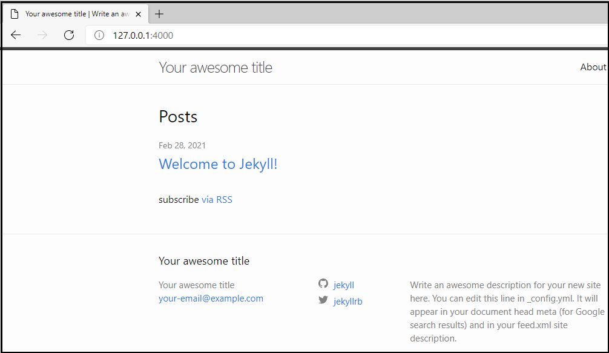

This article describes how to set up Windows Subsystem for Linux (WSL) on Windows 10 and then
install Ubuntu Linux, Ruby, and Jekyll to create a web development system. The purpose of the system
is to test documentation before you publish to a [GitHub Pages](https://pages.github.com) repository
to build a website. If you choose to customize your Jekyll configuration, this test system is useful
to develop the site and verify the changes before you upload to your live website.

You can copy and paste the commands from this article into your PowerShell and Ubuntu shell
sessions. The commands include the following syntax:

- `sudo` prompts you for your password but runs commands with administrator permissions.
- `&&` indicates that a command must be successful before the next command is run.
- `--yes` suppresses prompts.
- Angle brackets `<>` are a placeholder for your input. Replace the placeholder value and brackets with your value.

<div class="note">
<b>Note</b> <br>
Windows 10 includes Windows PowerShell 5.1 that can run the WSL commands used in this article. This
article uses PowerShell 7. If you plan to write scripts, do system administration, or deploy cloud
resources install the most recent version of PowerShell 7. For more information, see <a
href="https://docs.microsoft.com/powershell/scripting/install/migrating-from-windows-powershell-51-to-powershell-7">Migrating
from Windows PowerShell 5.1 to PowerShell 7</a>.
</div>

## Set up WSL

WSL allows you to run Linux and Linux command line applications on a Windows 10 computer using a [Bash shell](https://wikipedia.org/wiki/Bash_(Unix_shell)).
This article uses WSL 1 and if you want to compare WSL 1 and WSL 2, see [Comparing WSL 1 and WSL 2](https://docs.microsoft.com/windows/wsl/compare-versions).
For more details about the WSL 2 installation procedure, see [Windows Subsystem for Linux Installation Guide for Windows 10](https://docs.microsoft.com/windows/wsl/install-win10).

### Enable WSL

In this section you use PowerShell commands to enable WSL 1.

1. Start an elevated PowerShell session by doing a right-click on the PowerShell icon and selecting
   the option to **Run as Administrator**.

1. Verify that WSL is disabled on your computer with a PowerShell command.

   ```powershell
   (Get-WindowsOptionalFeature -Online -FeatureName Microsoft-Windows-Subsystem-Linux).State
   ```

    For more information, see [Get-WindowsOptionalFeature](https://docs.microsoft.com/powershell/module/dism/get-windowsoptionalfeature?view=win10-ps).

1. Enable WSL and restart the computer.

   ```powershell
   Enable-WindowsOptionalFeature -Online -FeatureName Microsoft-Windows-Subsystem-Linux -All
   ```

   For more information, see [Enable-WindowsOptionalFeature](https://docs.microsoft.com/powershell/module/dism/enable-windowsoptionalfeature?view=win10-ps).

## Install Ubuntu Linux

There are several Linux distributions available in the Microsoft Store. This article uses Ubuntu
Linux 20.04 LTS.

1. In the Windows Taskbar search field, enter _Microsoft Store_.
1. In the store application, search for _Ubuntu 20.04 LTS_.
1. Download and install Ubuntu with the **Get** button. If you did a previous Ubuntu installation,
   the button is labeled **Install**.
1. To start Ubuntu in a Bash shell, use the **Launch** button. The Ubuntu installation begins.
1. To set up a Linux user name and password, follow the prompts. After you sign in to Ubuntu, you'll
   see messages that updates are available.

   ```plaintext
   1 update can be installed immediately.
   0 of these updates are security updates.
   To see these additional updates run: apt list --upgradable

   The list of available updates is more than a week old.
   To check for new updates run: sudo apt update
   ```

1. Install the updates. The process takes several minutes and has verbose output.

   ```bash
   sudo apt update --yes && sudo apt upgrade --yes
   ```

   - The `apt update` command refreshes the list of available package updates.
   - The `apt upgrade` command installs the updates.

## Install Ruby

Jekyll is a Ruby application so you need to install Ruby. This example installs Ruby from [Brightbox](https://www.brightbox.com/docs/ruby/ubuntu/#installation)
as mentioned in the [Jekyll documentation](https://jekyllrb.com/docs/installation/windows).
Brightbox maintains the Ruby packages and the repository provides a complete Ruby installation that
meets the prerequisites for Jekyll.

1. Set up the Brightbox repository and update the packages and versions that are available.

   ```bash
   sudo apt-get install software-properties-common &&
   sudo apt-add-repository ppa:brightbox/ruby-ng --yes &&
   sudo apt-get update
   ```

1. Install Ruby and other essential packages such as GCC, G++, and Make.

   ```bash
   sudo apt-get install ruby2.7 ruby2.7-dev build-essential dh-autoreconf zlib1g-dev --yes
   ```

1. Verify the installation of Ruby and the other essential software.

   ```bash
   ruby --version &&
   gcc --version &&
   g++ --version &&
   make --version
   ```

   The output includes detailed information, but the important lines will look similar to the
   following versions:

   ```plaintext
   ruby 2.7.2p137 (2020-10-01 revision 5445e04352) [x86_64-linux-gnu]
   gcc (Ubuntu 9.3.0-17ubuntu1~20.04) 9.3.0
   g++ (Ubuntu 9.3.0-17ubuntu1~20.04) 9.3.0
   GNU Make 4.2.1
   ```

## Gems

After Ruby is installed, update the default gems that were installed. Gems are applications that do
specific tasks or add functionality. Most gems have dependencies with other gems. For example, the [Jekyll gem](https://rubygems.org/gems/jekyll)
page lists its dependencies.

<div class="note">
<b>Note</b> <br>
Ruby installs the default gems in <i>/usr/lib/ruby/gems/2.7.0/gems/</i> and the updates are
installed in <i>/var/lib/gems/2.7.0/gems</i>. To update files in those directories,
<code>sudo</code> is needed.
</div>

### Update .bashrc

The _.bashrc_ update is **optional** but recommended because it allows you to install gems in your
Linux user directory so that you don't need to use `sudo`. For more information, see the Jekyll
recommendation for an [Ubuntu installation](https://jekyllrb.com/docs/installation/ubuntu/).

To update _.bashrc_ and your Linux path run the following commands:

```bash
cp $HOME/.bashrc $HOME/.bashrc-backup &&
ls -lah $HOME &&
echo '# Install Ruby Gems to ~/gems' >> ~/.bashrc &&
echo 'export GEM_HOME="$HOME/gems"' >> ~/.bashrc &&
echo 'export PATH="$HOME/gems/bin:$PATH"' >> ~/.bashrc &&
source ~/.bashrc &&
echo $PATH
```

The commands do several tasks:

- Make a backup of _.bashrc_.
- List the files to verify the backup was successful to _.bashrc-backup_.
- Update _.bashrc_ with the `PATH` statements to install gems to your user directory.
- Run the `source` command to update the path in the current shell.
- Display the updated path. The path should show _/home/\<user name\>/gems/bin:_ as the first item.

<div class="tip">
<b>Tip</b> <br>
If <code>source</code> doesn't update the path, type <code>exit</code> to close the Linux shell.
Launch Ubuntu and the shell will start with the updated path.
</div>

### Update gems

Update and view the list of installed gems.

```bash
gem update && gem list
```

For more detailed information about a specific gem, such as the version or installed location, use
the `--details` option.

```bash
gem list bundler --details
```

## Install Jekyll

After your Ruby environment is setup, install the gems for Jekyll, Bundler, and GitHub Pages.

1. Install the gems.

   ```bash
   gem install jekyll bundler github-pages
   ```

1. Verify the installation.

   ```bash
   jekyll --version &&
   bundler --version &&
   github-pages --version
   ```

   You'll see output with version numbers for each application.

   ```plaintext
   jekyll 4.2.0
   Bundler version 2.2.11
   github-pages 212
   ```

## Create a test website

To test Jekyll, create a new directory, build a default site, and start a local instance of Jekyll
server.

1. In your `$HOME` directory, create a test site in a new directory named _testsite_ and start the
   Jekyll server.

   ```bash
   cd $HOME
   jekyll new ./testsite &&
   cd ./testsite &&
   bundle exec jekyll serve
   ```

   When the Jekyll server starts you'll see several messages similar to the following output. The
   `Server address` is your local website address.

   ```plaintext
   Configuration file: /home/<user name>/testsite/_config.yml
               Source: /home/<user name>/testsite
          Destination: /home/<user name>/testsite/_site
    Incremental build: disabled. Enable with --incremental
         Generating...
          Jekyll Feed: Generating feed for posts
                       done in 0.423 seconds.
                       Auto-regeneration may not work on some Windows versions.
                       Please see: https://github.com/Microsoft/BashOnWindows/issues/216
                       If it does not work, please upgrade Bash on Windows or run Jekyll with --no-watch.
    Auto-regeneration: enabled for '/home/<user name>/testsite'
       Server address: http://127.0.0.1:4000/
     Server running... press ctrl-c to stop.
   ```

   <div class="tip">
   <b>Tip</b> <br>
   You might see several warning messages such as <code>warning: already initialized
   constant</code>. These are common messages and shouldn't indicate a problem. If you have concerns
   for your environment, research the messages and confirm there's no problems for your computers.
   </div>

1. To confirm the site is running locally, open a browser and navigate to `http://127.0.0.1:4000` to
   view the default Jekyll site.

   

## Edit website files

After you confirm that your Jekyll environment is functional you can set up a [GitHub Pages](https://pages.github.com)
repository and clone the repository to your Windows computer. When you're ready to test your website
the safest method is to **only update files on your Windows system**. Then, copy files to Linux to
test the changes.

<div class="warning">
<b>Warning</b> <br>
To prevent file corruption or file locks, <b>don't copy files from Linux to Windows</b>, especially
the <i>.git</i> directory. Doing so might corrupt your git repository or destroy commit history.
</div>

The following tips should help you get started to copy updated files from Windows to Linux:

- From your Windows system copy your cloned repository directory to your Linux `$HOME` directory.
  You can access the Linux file system from Windows Explorer using the path `\\wsl$\Ubuntu-20.04`.

- The repository directory that you copied to the Linux system is owned by `root`. To fix that and
  the _Gemfile.lock_ error that occurs if you attempt to run the Jekyll server, update the
  permissions.

  `sudo chmod -R 777 $HOME/<your repository name>`

  The command gives all Linux users read, write, and execute permissions to the directory and its
  subdirectories.

- On your **Linux system** the repository's _.git_ directory isn't needed and can be deleted.

  `rm -r $HOME/<your repository name>/.git`

- When you're satisfied that the files you updated on Windows are ready for publication, commit your
  changes and push the updated content to your remote repository. Your GitHub Pages site will build
  with the updated content.

## Shut down the system

When you're finished, type these commands to shut down the Linux system:

| Operation | Command |
| ---- | ---- |
| Stop the Jekyll server | **Ctrl** + **C** |
| Exit Ubuntu Linux from Bash | `exit` |
| Shut down WSL from PowerShell | `wsl --shutdown` |

Run a command from PowerShell to confirm WSL is shutdown and it's state is **Stopped**:

```powershell
wsl --list --verbose
```

```plaintext
  NAME            STATE           VERSION
* Ubuntu-20.04    Stopped         1
```

## Clean up

If you no longer need your Linux test system, uninstall Ubuntu 20.04 LTS.

1. In the Windows Taskbar search field, enter _Apps & features_.
1. Search for _Ubuntu 20.04 LTS_.
1. Select **Ubuntu**, then select the button to **Uninstall**.

## Conclusion

In this article you built a web development system on Windows 10 using the Windows Subsystem for
Linux, Ubuntu Linux, Ruby, and Jekyll. You verified that the system is functional and ready to test
documentation and the website configuration before publication to GitHub Pages.
