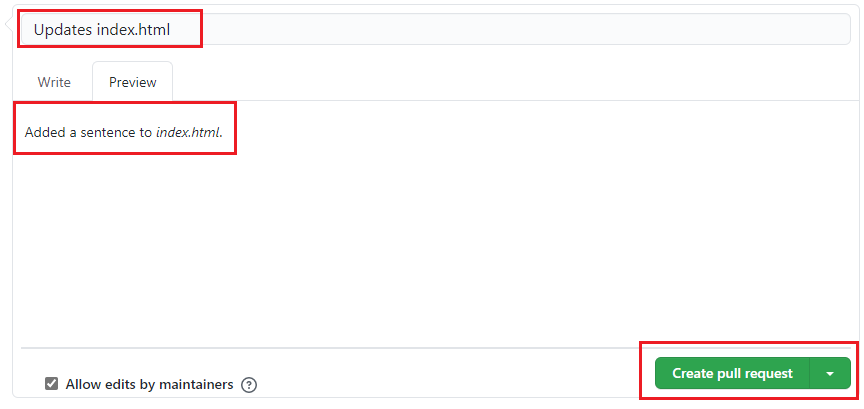

This article describes how to work in a shared repository where other people submit their commits.
You'll use a GitHub test repository and create a fork, which copies the repository to your GitHub
account. In your fork, you'll create a working branch and make a change. After you commit the change
to your fork, you'll submit a pull request. A pull request is how you ask the repository maintainer
to add your changes to their repository.

Visual Studio Code (VS Code) is used as the Markdown editor and the terminal for Git commands. If
you need to set up your environment, see [Git basics: Get started with Git and GitHub](https://davidsmatlak.github.io/git-basics#prerequisites).

<div class="note">
<b>Note</b> <br>
This article is written as a beginners guide for Git and GitHub. The GitHub repository
<i>octocat/Spoon-Knife</i> is used to create a fork and submit a pull request.
</div>

## Create a fork

To create a fork, use GitHub's _octocat/Spoon-Knife_ repository. The fork is a copy of the
repository that's stored in your GitHub account.

1. Sign in to [GitHub](https://github.com/login).
1. Go to the repository: [octocat/Spoon-Knife](https://github.com/octocat/Spoon-Knife).
1. On the top, right corner of the page, select the **Fork** button. A dialog box opens with the
   prompt **Where should we fork Spoon-Knife?**
1. Select the link for your GitHub account.

A page opens as the fork is created and the fork's name is `<GitHub account>/Spoon-Knife`. Under
your fork's name, _forked from octocat/Spoon-Knife_ links to the `upstream` repository.

## Clone the fork

After you create the fork, clone it to your computer.

1. Launch VS Code and open a terminal: **Terminal** > **New Terminal**.
1. Use PowerShell commands to create a directory for your repository and switch to that directory.

    ```powershell
    New-Item -Path "C:\github\forkdemo" -ItemType Directory
    Set-Location -Path "C:\github\forkdemo"
    ```

    `New-Item` creates the directory _C:\github\forkdemo_ and `Set-Location` switches to the
    directory.

1. From your GitHub fork, select the **Code** tab and select the **Code** button.
1. Select **HTTPS** and use the clipboard icon to copy the URL.
1. From the VS Code terminal, paste the link to clone the repository.

    ```shell
    git clone https://github.com/<GitHub account>/Spoon-Knife.git
    ```

    The output shows the progress.

    ```plaintext
    Cloning into 'Spoon-Knife'...
    remote: Enumerating objects: 16, done.
    remote: Total 16 (delta 0), reused 0 (delta 0), pack-reused 16
    Receiving objects: 100% (16/16), done.
    Resolving deltas: 100% (3/3), done.
    ```

1. After the clone is finished, switch to the repository's directory.

    ```powershell
    Set-Location -Path "C:\github\forkdemo\Spoon-Knife"
    ```

## Create an upstream remote

Each cloned GitHub repository creates a remote for the `fetch` and `pull` commands. When you work
with a shared repository, you need an `upstream` remote for the fork so that you can sync your
clone. In this example, the `upstream` remote is the URL for [octocat/Spoon-Knife](https://github.com/octocat/Spoon-Knife).

1. From a VS Code terminal, show the existing remote.

    ```plaintext
    git remote -v
    ```

    The output shows the `origin` remote for your fork.

    ```plaintext
    origin  https://github.com/<GitHub account>/Spoon-Knife.git (fetch)
    origin  https://github.com/<GitHub account>/Spoon-Knife.git (push)
    ```

1. Create the `upstream` remote for `octocat/Spoon-Knife`.

    ```plaintext
    git remote add upstream https://github.com/octocat/Spoon-Knife
    ```

1. Run `git remote` to display the new `upstream` remote.

    ```plaintext
    origin  https://github.com/<GitHub account>/Spoon-Knife.git (fetch)
    origin  https://github.com/<GitHub account>/Spoon-Knife.git (push)
    upstream        https://github.com/octocat/Spoon-Knife (fetch)
    upstream        https://github.com/octocat/Spoon-Knife (push)
    ```

1. Sync your clone with the `upstream` repository so that your local clone has the most recent files.

    ```plaintext
    git fetch upstream
    ```

    The output shows the branches that are fetched from `upstream`.

    ```plaintext
    From https://github.com/octocat/Spoon-Knife
     * [new branch]      change-the-title -> upstream/change-the-title
     * [new branch]      main             -> upstream/main
     * [new branch]      test-branch      -> upstream/test-branch
    ```

1. From the `main` branch, merge the changes.

    ```plaintext
    git checkout main
    git merge upstream/main
    ```

    Because we're using a test repository, there won't be any changes in the upstream repository. In
    a real world scenario, there would be changes to merge.

    ```plaintext
    Already on 'main'
    Your branch is up to date with 'origin/main'.

    Already up to date.
    ```

1. After the merge, only your local clone is updated. To finish the repository sync, you need to
   `push` the changes to GitHub.

    ```plaintext
    git push origin main
    ```

## Create a working branch

From the `main` branch of your `Spoon-Knife` clone, use the following commands to create a working
branch. This example names the working branch `my-test-pull-request`.

```plaintext
git checkout -b my-test-pull-request
git push origin my-test-pull-request
```

<div class="tip">
<b>Tip</b> <br>
For more details about how to create a working branch, see <a
href="https://davidsmatlak.github.io/git-basics-branch-merge#create-a-working-branch">Create a
working branch</a>.
</div>

## Commit a change

Edit a file and commit the change. The `Spoon-Knife` repository contains _index.html_ that has a
section labeled for edits.

1. From VS code, open _index.html_.
1. Edit the file and save the change.
1. Commit the change.

    ```plaintext
    git add .
    git commit -m "updates index.html"
    ```

1. Push the change to your fork.

    ```plaintext
    git push origin my-test-pull-request
    ```

<div class="tip">
<b>Tip</b> <br>
For more details about how to edit and commit, see <a
href="https://davidsmatlak.github.io/git-basics-branch-merge#edit-a-file">Edit a file</a>.
</div>

## Create a pull request

After your commit is pushed to your fork you submit a pull request. This is the standard practice
because contributor's to an `upstream` repository don't have `write` access to the repository.

1. From your GitHub account, go to your `octocat/Spoon-Knife` fork.
1. On the fork's **Code** tab you'll see banner that you pushed changes to your working branch.

    

1. Select the **Compare & pull request** button and the page to **Open a pull request** is displayed.
1. Verify that your fork and branch will be merged into the upstream repository and `main` branch.

    

1. Add a title and comment to explain your pull request, then select the **Create pull request**
   button.

    

<div class="note">
<b>Note</b> <br>
In a real world scenario, after a pull request is submitted, the repository's maintainer reviews
your pull request. The maintainer will either request additional changes or approve your pull
request and merge your changes into the `upstream` repository.
</div>

<div class="tip">
<b>Tip</b> <br>
For this example, after you submit your pull request, you should <b>close</b> it because the
repository doesn't merge the changes.
</div>

## Clean up

When you're done and no longer need the repository, delete your repository from GitHub and the local
clone.

1. From GitHub, there's a drop-down menu at the top, right of the page. Select **Your repositories**
1. Select **Spoon-Knife**.
1. Select **Settings** and scroll down to **Danger Zone**.
1. Select **Delete this repository** and follow the prompts.
1. To delete your local clone, remove _C:\github\forkdemo\Spoon-Knife_.

## Conclusion

In this article you learned how to fork a repository and submit a pull request. To learn more, see
the documentation for [Git](https://git-scm.com/docs) and [GitHub](https://docs.github.com/github).
